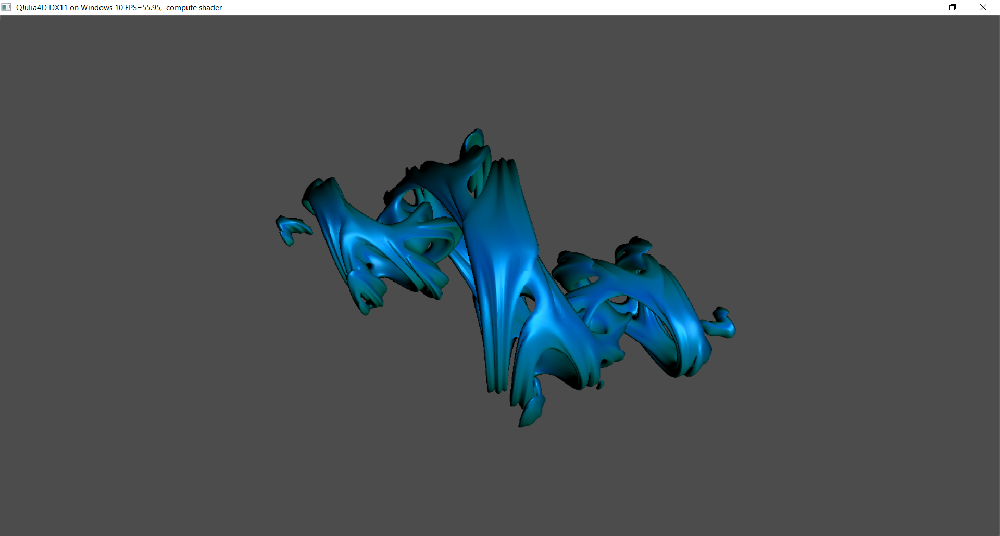
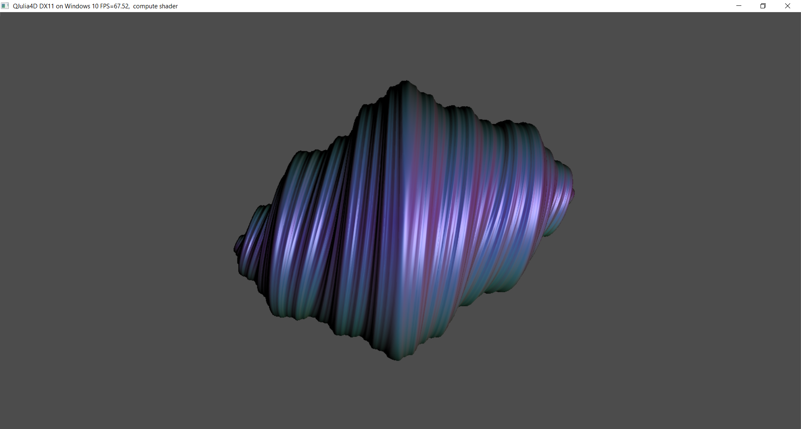
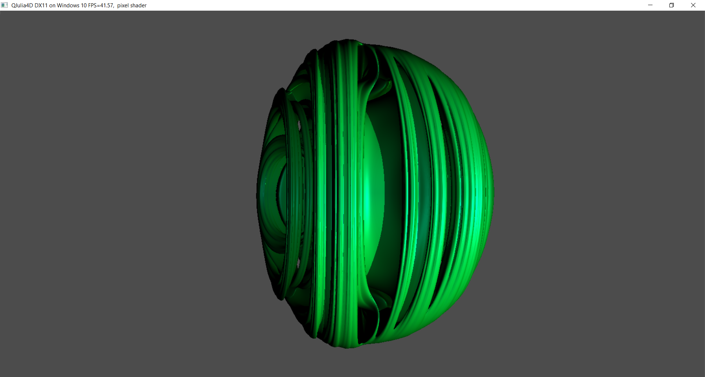

QJulia4D
===============

5 Jan 2017 by ychding11

Info
====

Raytraced morphing Julia quaternion fractal.
on windows 10 platform

Source
======

The original Cg code is by [Keenan Crane](http://www.cs.cmu.edu/~kmcrane/Projects/QuaternionJulia/)
Then ported to HLSL by [Jan Vlietinck] (http://users.skynet.be/fquake/)
But source code cannot be built on Windows 10 because of old DX APIs, I ported it to make it build OK on Windows 10 platform.
The default configuration is Release x64.

Demos
========

Controls
========

Space bar           : toggle morphing animation
Mouse left drag     : rotate fractal
Mouse wheel         : zoom in/out
P key               : toggle between compute and pixel shader
S key               : toggle selfshadow
+/- num key         : increase /decrease fractal detail
Alt + Enter         : toggle full screen
